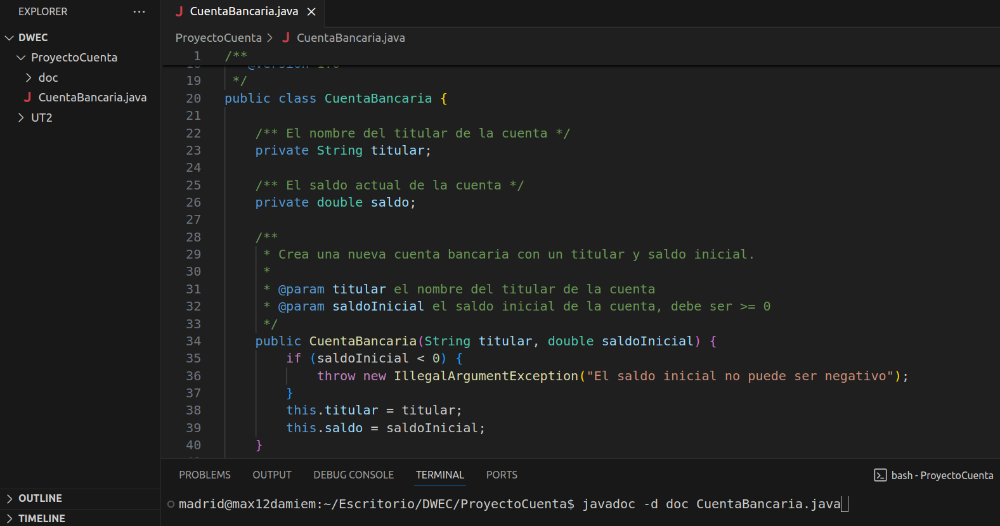
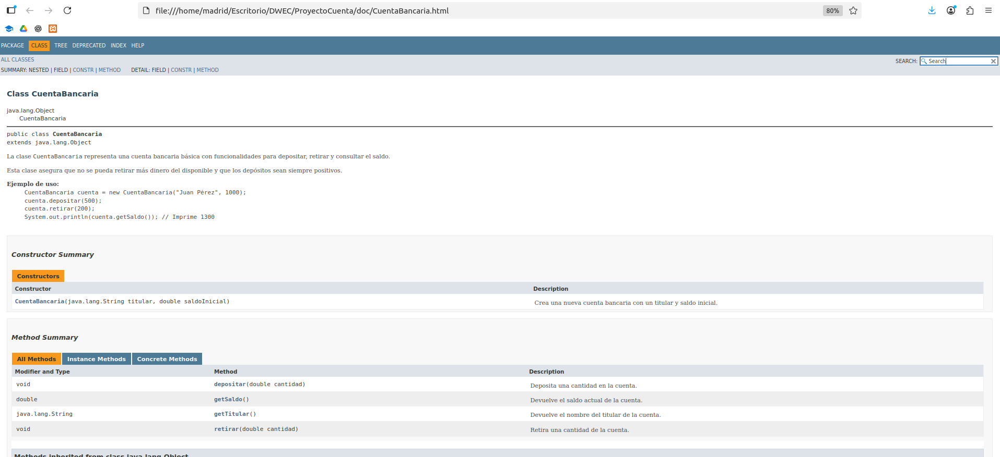
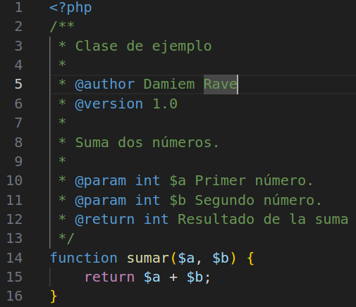
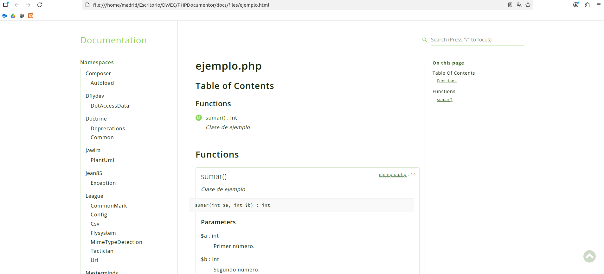
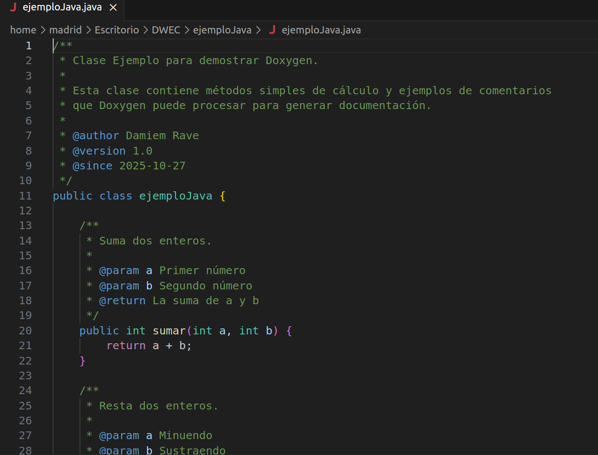
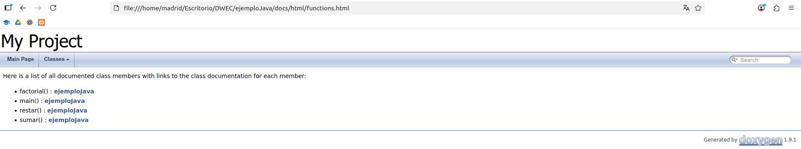

# Herramientas de Generación de Documentación


**Autor:** Damiem

**Secciones del PDF:** 6.2 y 6.3 (Páginas 186-197)


---


# 📋 Índice


1. [Introducción](#introducción)

2. [6.2. Herramientas externas para la generación de documentación](#herramientas)

   - [6.2.1. Javadoc](#javadoc)

   - [6.2.2. phpDocumentor](#phpdocumentor)

   - [6.2.3. Doxygen](#doxygen)

3. [6.3. Formatos estándar para la documentación](#formatos)

4. [Conclusiones](#conclusiones)

5. [Referencias](#referencias)


---


# Introducción


Como el propio nombre indica veremos herramientas de documentación de todo lo que rodea una aplicación web. La documentación es importante ya que nos ayuda a entender mucho más rápido el funcionamiento del código ya sea lo revises tu después de un tiempo u otra persona totalmente ajena al desarrollo original por ende, nos ahorra tiempo y trabajo.


---


# 6.2. Herramientas externas para la generación de documentación {#herramientas}


## Javadoc {#javadoc}

Es la herramienta de Oracle por excelencia para generar documentación en
formato HTML a partir del código desarrollado en Java. La mayoría de los IDE de Java generan automáticamente la documentación, y uno de ellos es Netbeans 8.2, pero todas las versiones tienen esta posibilidad

La sintaxis se basa en bloques `/** ... */` y etiquetas especiales como `@param`, `@return` o `@throws`.

### Instalación de Javadoc
Independientemente del sistema operativo y del IDE que utilices, Javadoc se instala al instalar un JDK (Java Development Kit).

### Claves para documentar con Javadoc

1.  **Documentar la clase**

    -   Explica **qué hace la clase** y **para qué sirve**.

    -   Incluye ejemplos de uso con `<pre>` para mostrar código formateado.

2.  **Documentar los atributos**

    -   Breve descripción de cada atributo, especialmente si no es evidente.

3.  **Documentar los constructores**

    -   Explica los parámetros con `@param`.

    -   Indica excepciones que pueda lanzar con `@throws`.

4.  **Documentar los métodos**

    -   Describe qué hace el método.

    -   Detalla los parámetros (`@param`) y el valor de retorno (`@return`).

    -   Incluye las posibles excepciones (`@throws`).

5.  **Usar etiquetas de versión y autor**

    -   `@author` para identificar al creador.

    -   `@version` para controlar versiones de la clase.

6.  **Formateo y estilo**

    -   Usa `<p>` para párrafos, `<b>` para resaltar y `<pre>` para ejemplos.

    -   Mantén las descripciones claras y concisas.

A continuación, un ejemplo completo y cómo documentarlo correctamente.

```java
/**
 * La clase {@code CuentaBancaria} representa una cuenta bancaria básica
 * con funcionalidades para depositar, retirar y consultar el saldo.
 * <p>
 * Esta clase asegura que no se pueda retirar más dinero del disponible
 * y que los depósitos sean siempre positivos.
 * </p>
 * 
 * <b>Ejemplo de uso:</b>
 * <pre>
 *     CuentaBancaria cuenta = new CuentaBancaria("Juan Pérez", 1000);
 *     cuenta.depositar(500);
 *     cuenta.retirar(200);
 *     System.out.println(cuenta.getSaldo()); // Imprime 1300
 * </pre>
 * 
 * @author Juan Pérez
 * @version 1.0
 */
public class CuentaBancaria {

    /** El nombre del titular de la cuenta */
    private String titular;

    /** El saldo actual de la cuenta */
    private double saldo;

    /**
     * Crea una nueva cuenta bancaria con un titular y saldo inicial.
     * 
     * @param titular el nombre del titular de la cuenta
     * @param saldoInicial el saldo inicial de la cuenta, debe ser >= 0
     */
    public CuentaBancaria(String titular, double saldoInicial) {
        if (saldoInicial < 0) {
            throw new IllegalArgumentException("El saldo inicial no puede ser negativo");
        }
        this.titular = titular;
        this.saldo = saldoInicial;
    }

    /**
     * Deposita una cantidad en la cuenta.
     * 
     * @param cantidad la cantidad a depositar; debe ser mayor que 0
     * @throws IllegalArgumentException si la cantidad es negativa o cero
     */
    public void depositar(double cantidad) {
        if (cantidad <= 0) {
            throw new IllegalArgumentException("La cantidad a depositar debe ser mayor que cero");
        }
        saldo += cantidad;
    }

    /**
     * Retira una cantidad de la cuenta.
     * 
     * @param cantidad la cantidad a retirar; debe ser mayor que 0 y menor o igual al saldo
     * @throws IllegalArgumentException si la cantidad es negativa o excede el saldo
     */
    public void retirar(double cantidad) {
        if (cantidad <= 0) {
            throw new IllegalArgumentException("La cantidad a retirar debe ser mayor que cero");
        }
        if (cantidad > saldo) {
            throw new IllegalArgumentException("Fondos insuficientes");
        }
        saldo -= cantidad;
    }

    /**
     * Devuelve el saldo actual de la cuenta.
     * 
     * @return el saldo actual
     */
    public double getSaldo() {
        return saldo;
    }

    /**
     * Devuelve el nombre del titular de la cuenta.
     * 
     * @return el nombre del titular
     */
    public String getTitular() {
        return titular;
    }
}
```
### Ejecución de Javadoc
Una vez la clase creada y el código todo comentado, se debe ejecutar en la terminal desde la carpeta donde se encuentra la clase de java el comando javadoc con la opción -d, el nombre del directorio donde se creará la estructura que alojará los archivos HTML y por último el archivo de la clase Java.
``` java
javadoc -d directorio-para-html Clase.java
```


Ejemplo ejecución del comando



Una vez generada la estructura, podemos abrir el archivo `index.html`:



### Más parámetros de Javadoc:
- `@author`  
  Este atributo permite declarar el **nombre del autor** de la clase.

- `@deprecated`  
  Indica que un elemento (por ejemplo, una clase o método) está **obsoleto** y **no se recomienda su uso**.  
  Puede ser por varias razones:  
  1. Existe un **problema de seguridad o bug**.  
  2. La forma de programar esa parte es considerada **mala práctica**.  
  3. Existe una **versión más actual** que reemplaza a la obsoleta.

- `@param`  
  Permite la **definición de un parámetro** de un método.  

- `@see`  
  Se utiliza para **asociar un método o clase** relacionada.

- `@serial`  
  Describe el motivo de un **campo serializable** y sus posibles valores.

- `@since`  
  Indica **la versión del producto** en la que se está introduciendo la clase o método.

- `@version`  
  Es la **versión numérica** de una clase o un método.  
  - Se puede comenzar por `0` o `1`.  
  - Posteriormente se incrementa conforme se implementen nuevas versiones, por ejemplo: `1.1`, `1.2`, etc.  
  - La secuencia la determina el programador o el equipo de desarrollo.


## 6.2.2. phpDocumentor {#phpdocumentor}

Esta herramienta genera documentación para el lenguaje de programación PHP.

### Instalación de phpDocumentor
Necesitas instalar Composer primero y luego instalar phpDocumentor.
Luego este funcionará desde terminal o cualquier editor como VSCode.

**Requisitos**

- Tener instalado **PHP** en tu sistema (si usas XAMPP, ya lo tienes).  
- Tener instalado **Composer**.
Composer es un gestor de dependencias de PHP. Permite instalar herramientas como PHPDocumentor fácilmente.

###  Instalación

Antes de nada, hay que preparar un proyecto

1.  Crea una carpeta para tu proyecto:

```bash
mkdir -p ~/Escritorio/PHP/Proyecto
cd ~/Escritorio/PHP/Proyecto
```
2. Crea tu archivo PHP (`ejemplo.php`):
```
<?php
/**
 * Clase de ejemplo
 * 
 * @author Damiem Rave
 * @version 1.0
 *
 * Suma dos números.
 *
 * @param int $a Primer número.
 * @param int $b Segundo número.
 * @return int Resultado de la suma
 */
function sumar($a, $b) {
    return $a + $b;
}
?>
```
3. Crear un proyecto válido con Composer
 - Inicializa Composer en la carpeta del proyecto:
  ```bash
  composer init
  ```
 -  Responde a las preguntas. Lo más importante es el **nombre del paquete**, que debe seguir el formato `usuario/paquete`:
 ```
 Package name: madrid/phpdocumentor-ejemplo
Description: Proyecto de prueba para PHPDocumentor
Author: tu_nombre
Minimum Stability: stable
Package Type: library
 ```
 Puedes dejar el resto de opciones por defecto.
 
 4. Instalar PHPDocumentor

Instala PHPDocumentor localmente en tu proyecto:
 ```bash
 composer require --dev phpdocumentor/proyecto
  ```
  Esto creará la carpeta `vendor/` y permitirá ejecutar PHPDocumentor desde `vendor/bin/phpdoc`.
  
  5. Generar la documentación

Ejecuta el siguiente comando en la carpeta del proyecto:
 ```bash
vendor/bin/phpdoc -d . -t docs
  ```
  -   `-d .` → lee todos los archivos PHP de la carpeta actual

-   `-t docs` → genera la documentación en la carpeta `docs`

6. Ver la documentación

- Abre la carpeta `docs` creada dentro del proyecto:
 ```bash
~/Escritorio/PHP/Proyecto/docs/
  ```
  - Abre el archivo `index.html` en tu navegador.
  - Verás una página web con la documentación de tu archivo `ejemplo.php`.
  
  ### Ejemplo de documento PHP comentado
  
  
  ### EJemplo de documentación generada con PHPDocumentor
  
    
### Los elementos que pueden ser documentados son los siguientes:

- **Variables globales**  
  Permite describir las variables que se usan a nivel global en el programa.

- **Clases**  
  Se documenta la definición de la clase, su propósito y ejemplos de uso.

- **Funciones**  
  Permite describir la funcionalidad de cada función y sus parámetros.

- **Métodos y atributos**  
  Documenta los métodos y atributos de las clases, incluyendo parámetros, valores de retorno y visibilidad.

- **Sentencias**  
  Permite documentar bloques de código o sentencias específicas que sean relevantes para el entendimiento del programa.

### Documentación de bloques de código y paquetes en PHP

En PHP, además de documentar variables, clases y funciones, también se pueden documentar **bloques de código** y hacer referencia a **archivos específicos**, ya que una aplicación normalmente está compuesta por varios archivos.  

- La etiqueta que permite esta documentación es `@package`.  
  - Permite agrupar clases, funciones o bloques de código dentro de un **paquete lógico**.  
  - Facilita entender la estructura y organización del proyecto.

---

### Documentación según el patrón Modelo-Vista-Controlador (MVC)

En aplicaciones que siguen el patrón MVC, se recomienda documentar cada componente de manera específica:

1. **Vista o Interfaz**  
   - Qué permite realizar.  
   - Cómo lo hace.  
   - Qué retorna o muestra al usuario.  

2. **Modelo**  
   - Qué algoritmos utiliza.  
   - Qué estructura de datos tiene.  
   - Qué flujo de información sigue internamente.  

3. **Controlador**  
   - Qué métodos utiliza para gestionar el flujo entre la vista y el modelo.  
   - Cómo optimizar los métodos para mejorar rendimiento y mantenimiento.  

### Etiquetas comunes en phpDocumentor

Al igual que en Javadoc, en phpDocumentor existen **etiquetas para documentar bloques de código**, todas precedidas por `@`.  

### Bloques de documentación generales

- `@author`  
  Autor que implementa el código.

- `@copyright`  
  Derechos de autor.

- `@access`  
  Indica la visibilidad del elemento:  
  - `public` → se genera documentación.  
  - `private` → no se genera documentación.  
  - Valor por defecto: `public`.

- `@deprecated`  
  Indica que un elemento está **obsoleto** y no debería usarse en futuras versiones.

- `@internal`  
  Permite indicar documentación **solo para programadores**, no pública.

- `@version`  
  Versión actual del código.

---

### Etiquetas para funciones

- `@global`  
  Indica el uso **global de una variable** dentro de la función.

- `@return`  
  Valor devuelto por la función.

- `@param`  
  Parámetro o parámetros que recibe la función.

- `@var`  
  Se usa para documentar **los atributos de una clase**.


## 6.2.3. Doxygen {#doxygen}
**Doxygen** es una herramienta de documentación automática que:
-   Analiza el **código fuente** de varios lenguajes (C, C++, Java, Python, PHP, Fortran, etc.).
-   Genera documentación en **HTML, PDF, RTF, LaTeX**, y otros formatos.
-   Usa comentarios especiales en el código (similar a PHPDoc o JavaDoc) para crear documentación legible y profesional.

En otras palabras, es como PHPDocumentor, pero **mucho más versátil y multilenguaje**.

Los principales son:

| Lenguaje | Comentarios compatibles |
| --- | --- |
| C / C++ | `/** ... */` y `/// ...` |
| Java | `/** ... */` (JavaDoc) |
| Python | `""" ... """` y `# ...` |
| PHP | `/** ... */` (PHPDoc) |

Doxygen es especialmente popular en **C y C++** en entornos industriales, embebidos o científicos.

## Características principales

-   Genera **diagramas de clases y dependencias** (si instalas Graphviz).

-   Permite **documentar funciones, clases, variables y macros**.

-   Soporta etiquetas como:

    -   `@param` → describe parámetros

    -   `@return` → describe valores de retorno

    -   `@author`

    -   `@deprecated`

    -   `@see`

    -   `@example` → para incluir ejemplos de uso

-   Puede generar documentación **para todo un proyecto**, incluyendo jerarquías de carpetas y módulos.

### Instalación y uso
1.  **Instalar Doxygen**
 - En Linux:
 ```bash
sudo apt install doxygen graphviz
  ```
- Windows: descargar desde doxygen.nl  
2. **Crear un archivo de configuración**
```bash
   doxygen -g
```
Esto genera `Doxyfile`, donde puedes configurar:

-   Carpeta de código fuente (`INPUT`)

-   Carpeta de salida (`OUTPUT_DIRECTORY`)

-   Formato de salida (`GENERATE_HTML`, `GENERATE_LATEX`, etc.)
3. **Ejecutar Doxygen**
```bash
doxygen Doxyfile
```
Generará la documentación en la carpeta que hayas definido (`html/`, `latex/`, etc.)

4. **Abrir la documentación**

Abre `html/index.html` en tu navegador para ver la documentación completa.

  ### Ejemplo de documento Java comentado
    
  
  ### Ejemplo de documentación generada con Doxygen
  

---


## 6.3. Formatos estándar para la documentación {#formatos}

### Objetivo

-   Facilitar la **comprensión del código** por otros programadores o en el futuro.

-   Permitir **reutilizar el código** sin estudiar cada línea en detalle.

-   Documentar **clases, métodos, variables y flujo general** de forma clara y concisa.

### Nomenclatura

-   Usar **nombres significativos** para clases, métodos y variables.

-   Ejemplo: un entero que indica posición → `iposicion` o `iposition` según idioma.

### Tipos de comentarios
**Comentario en línea**: `//`
```java
// Atributos
```
**Comentario en bloque**: `/* ... */`
```java
// Atributos
```
**Comentario para documentación (JavaDoc/PHPDoc)**: `/** ... */`
```java
/**
 * Clase Autor
 * Contiene información sobre el autor
 * @author Damiem
 * @version 1.0
 */
```
### Documentación de clases
-   **Nombre** de la clase: identificativo y descriptivo.

-   **Descripción**: breve resumen de la función de la clase.

-   **Autor**: quien implementa la clase.

-   **Versión**: control de cambios.

```java
/**
 * Clase Autor
 * Contiene información sobre el autor
 * @author Javier
 * @version 1.0
 */
public class Autor {
    // Atributos
    /** Nombre del autor */
    private String nombre;
    /** Ciudad del autor */
    private String ciudad;
    /** Lista de libros */
    private List libros;
}
```
### Constructores y métodos
Documentar **tipo de método**, **nombre**, **parámetros** y **valor de retorno**.
```java
/**
 * Constructor Autor
 * @param nombre Nombre del autor
 * @param ciudad Ciudad del autor
 */
public Autor(String nombre, String ciudad) {
    this.nombre = nombre;
    this.ciudad = ciudad;
    this.libros = new ArrayList();
}

/**
 * setNombre
 * @param n Nombre del autor
 */
public void setNombre(String n){
    this.nombre = n;
}

/**
 * getNombre
 * @return Nombre del autor
 */
public String getNombre(){
    return this.nombre;
}
```
### Beneficios
-   Facilita la **lectura y mantenimiento del código**.

-   Permite **generar documentación automáticamente** con herramientas como **Doxygen, PHPDocumentor o JavaDoc**.

-   Mejora la **reutilización del código** en futuros proyectos.

---


# Conclusiones


Con todo esto hemos visto que existen distintos métodos y herramientas para generar documentación de una forma más sencilla y hemos aprendido el valor de comentar el código para los proyectos.


---


# Referencias


1. Material de clase - TeoriaDoc.pdf (Páginas 3 - 14 del pdf o 186-197 del libro)

2. [Javadoc Official Documentation](https://docs.oracle.com/javase/8/docs/technotes/tools/windows/javadoc.html)

3. [phpDocumentor](https://www.phpdoc.org/)

4. [Doxygen](https://www.doxygen.nl/)
