# Git y Control de Versiones

**Autor:** Sergio Belvís Barba

**Páginas:** 204 - 214

---

# 📋 Índice

1. Introducción
2. [Conceptos Básicos](#conceptos)

   * [Repositorio](#repositorio)
   * [Branch](#branch)
   * [Change](#change)
   * [Commit](#commit)
   * [Revisión](#revision)
   * [Conflicto](#conflicto)
3. [Sistemas de Control de Versiones](#sistemas)

   * [Centralizado](#centralizado)
   * [Local](#local)
   * [Distribuido](#distribuido)
4. [Instalación y Configuración de Git](#instalacion-git)
5. [Uso de Git con GitHub](#github)
6. [Integración con NetBeans](#netbeans)
7. [Operaciones Avanzadas](#operaciones-avanzadas)
   
   * [Diff](#diff)
   * [Branch](#branch)
   * [Merge](#merge)
   * [Conflict](#conflict)
8. [Conclusiones](#conclusiones)
9. [Referencias](#referencias)

---

# Conceptos Basicos

## Repositorio {#repositorio}

Es el lugar donde se almacena todo el proyecto y su historial de versiones. En él se guarda el código fuente y cada cambio realizado a lo largo del tiempo. Puede estar en el ordenador del desarrollador (local) o en un servidor remoto como GitHub.

## Branch {#branch}

Una rama es una copia del proyecto principal donde se puede trabajar de forma independiente. Sirve para desarrollar nuevas funciones o corregir errores sin alterar el código estable. Cuando los cambios están listos, se puede fusionar con la rama principal.

## Change {#change}

Cada modificación que se hace en un archivo del proyecto se considera un cambio. Estos pueden ser líneas de código nuevas, eliminaciones o ajustes en el contenido existente.

## Commit {#commit}

Un commit es el paso en el que se registran oficialmente los cambios realizados en el repositorio. Cada commit guarda una descripción del trabajo hecho, el autor y la fecha, permitiendo así un control preciso del progreso.

## Revisión {#revision}

Cada vez que se hace un commit, se crea una nueva versión o revisión del proyecto. Esto permite comparar versiones anteriores, volver atrás o analizar cómo ha evolucionado el código.

## Conflicto {#conflicto}

Ocurre cuando dos o más personas modifican la misma parte del código en ramas diferentes. El sistema detecta la diferencia y pide al equipo que decida qué versión conservar. Resolver conflictos correctamente es clave para mantener la estabilidad del proyecto.

---

# Sistemas de Control de Versiones {#sistemas}

## Centralizado {#centralizado}

Un sistema donde todo el historial de versiones se almacena en un servidor central.

## Local {#local}

Cada desarrollador tiene una copia completa del repositorio en su máquina.

## Distribuido {#distribuido}

Combina ambos sistemas: cada desarrollador tiene un repositorio completo, y se sincroniza con un servidor central.

---

# Instalación de Git con GitHub {#instalacion-git}

1. Accedemos a la página oficial de [Git](https://git-scm.com/install/windows) y le damos click a “Click here to download”.

2. Cuando lo tengamos instalado, lo ejecutamos y nos va a saltar un pop-up con el instalador.

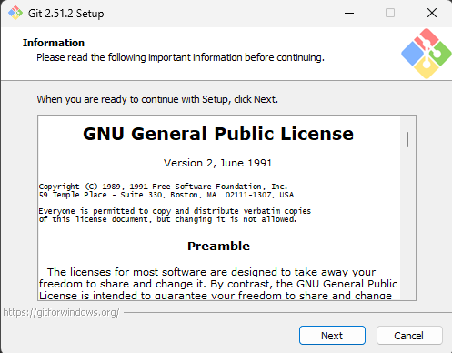

3. Para instalarlo con la configuración básica e inicial, le damos al botón de “Next” hasta tener una pantalla de carga. Después de eso, le damos a Finish y ya tendremos instalado Git.

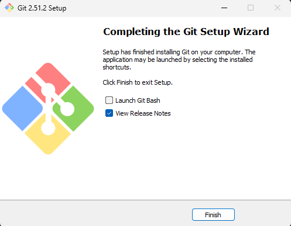

4. Ahora toca crear una cuenta de GitHub si es que no tenemos una ya. (Si ya tienes una cuenta de GitHub, inicia sesión y dirígete al punto 5). 
Nos dirigimos a la página oficial de [GitHub](https://github.com/) y, en el medio de la pantalla accedemos al botón verde que pone “Sign up for GitHub”. Después de esto, añadimos nuestros datos y creamos nuestra cuenta.

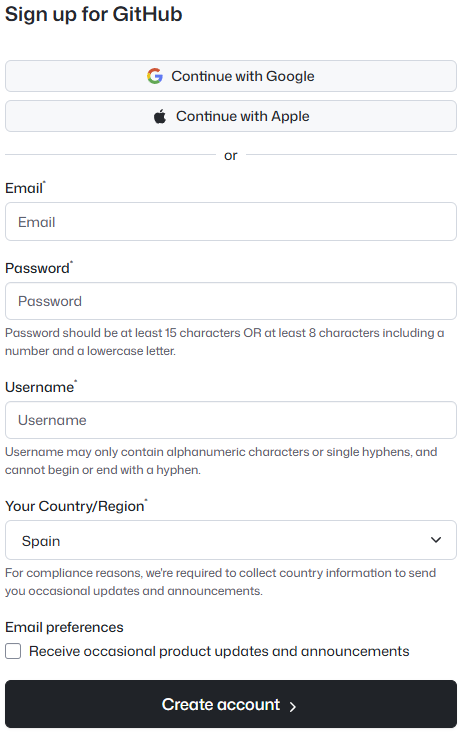

5. Iniciamos sesión y ahora crearemos un nuevo repositorio de GitHub. Arriba a la derecha le damos al botón “+“ y a “New Repository”. En la siguiente página, indicamos los datos del repositorio, como el nombre, la descripción y si quieres que el repositorio sea público o privado.

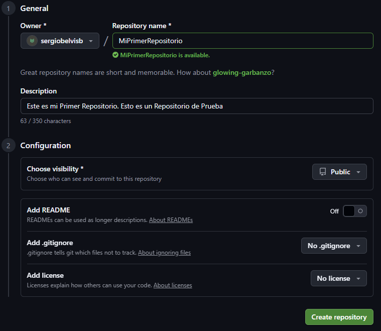

6. Al crear el repositorio, en un recuadro azul nos aparece el enlace del repositorio, lo copiamos.

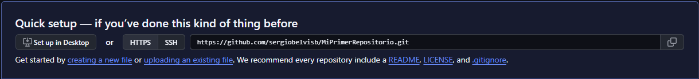

7. Al crear el repositorio, nos vamos a la consola (cmd). Creamos una carpeta para utilizar el repositorio, entramos a ella y ponemos el comando `git init` para inicializar un nuevo repositorio local. Creamos un archivo de prueba (En este caso README.txt) y añadimos texto dentro.

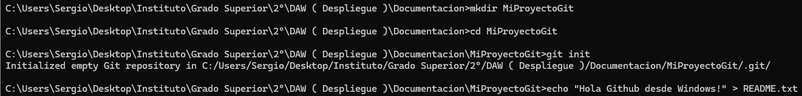

8. Indicamos nuestra configuración personal con los siguientes comandos.

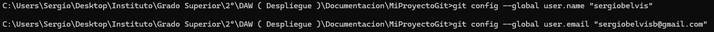

9. Con los siguientes comandos, indicamos que los ficheros que queremos subir al repositorio online los ficheros que tenemos en local en esa misma carpeta. Con el último comando, indicamos el repositorio al que queremos mandarlo, para ello, necesitamos la URL que copiamos anteriormente.

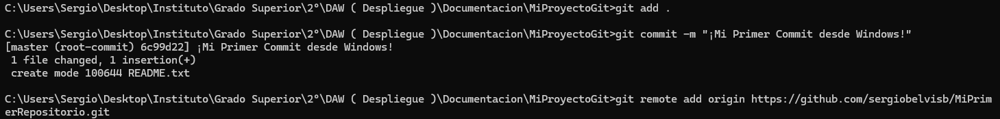

10. Con el siguiente comando, subimos los ficheros indicados. Después, nos aparecerá una ventana para iniciar sesión en GitHub.

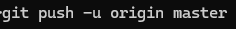

11. Si le damos a “Sign in with your browser” nos aparecerá la ventana, a la que solo tenemos que autorizar.

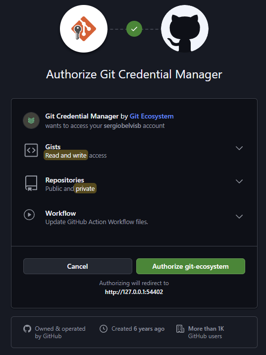

12. Al autorizar, podremos ver en la terminal que ya ha terminado de subirse los archivos.

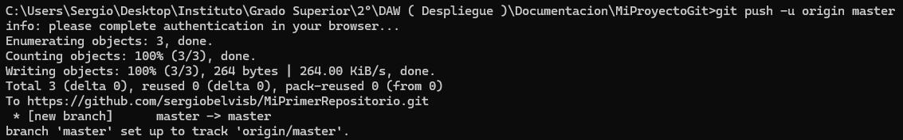

13. Y si entramos desde la web al repositorio, podremos ver el archivo creado localmente.

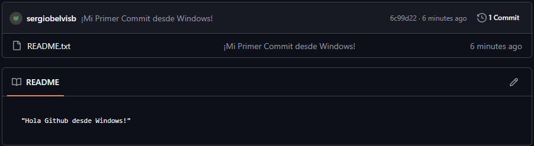

---

# NetBeans {#netbeans}

1. Dirígete a la página oficial de [NetBeans](https://netbeans.apache.org/download/) e instalamos la versión más reciente. Al abrirlo, aceptamos hasta tener el programa instalado.

2. Dentro de NetBeans, importamos el proyecto que queramos subir. Le damos click derecho al nombre del proyecto y, abajo, aparece “Versioning”.

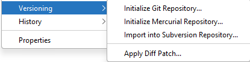

3. Inicializamos el repositorio dándole a la primera opción “Initialize Git Repository”. 
Después, volvemos a la opción ”Versioning” y le damos a “Add”.

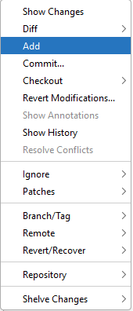

4. Vamos al menú de “Versioning” de nuevo y le damos a “Commit”, en la nueva ventana añadimos el mensaje del commit que queramos que se añada.

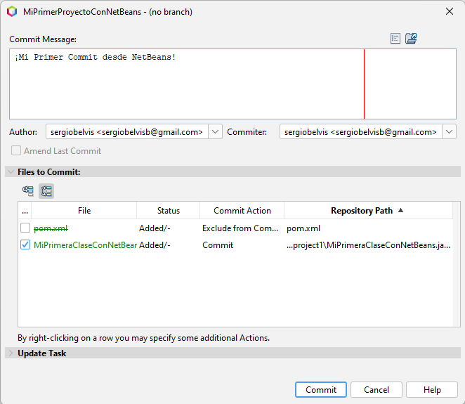

5. Dentro del mismo menú, vamos a “Remote” y a “Push”.

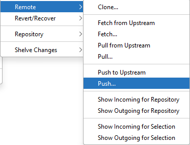

6. En la nueva ventana, añadimos en el campo “Repository URL” el enlace que copiamos anteriormente. Añadimos también nuestro usuario y contraseña.

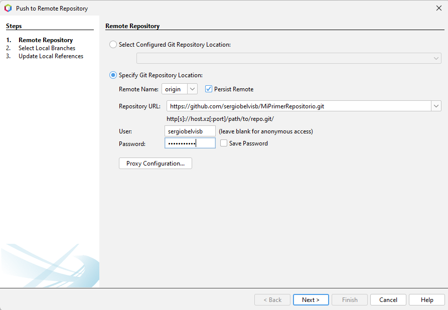

7. Indicamos la rama a la que queramos subir el proyecto.

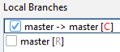

8. Y ¡ya hemos subido nuestro proyecto a GitHub desde NetBeans! Si vamos al repositorio desde el navegador web podremos ver el proyecto subido.

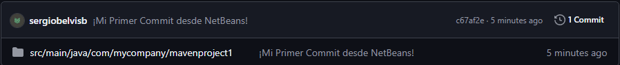

---

# Operaciones Avanzadas {#operaciones-avanzadas}

## Diff {#diff}

Permite comparar dos versiones de un mismo archivo o del proyecto completo. Sirve para ver exactamente qué líneas se han modificado, añadido o eliminado entre un commit y otro.

## Branch {#branch-avanzado}

Se utiliza para gestionar ramas dentro del repositorio. Con él se pueden crear, listar o eliminar ramas, lo que permite mantener distintas líneas de desarrollo en paralelo. Esto resulta útil para trabajar en nuevas características o correcciones sin afectar la versión principal del proyecto.

## Merge {#merge}

Combina el contenido de una rama con otra, integrando los cambios realizados en diferentes líneas de desarrollo. Es una operación clave para unificar el trabajo de varios desarrolladores o incorporar mejoras probadas a la versión principal. Git intenta realizar esta función automáticamente, pero puede requerir intervención si hay conflictos.

## Conflict {#conflict}

Ocurre durante un merge cuando Git detecta que dos versiones del mismo archivo fueron modificadas en la misma zona y no puede decidir cuál conservar. En ese caso, detiene la fusión y marca el archivo afectado para que el usuario elija qué cambios mantener. Resolver conflictos correctamente garantiza la coherencia del código y evita la pérdida de información.

---

# Conclusiones {#conclusiones}

Hemos visto cómo usar Git y GitHub desde la instalación hasta operaciones avanzadas, incluyendo NetBeans. Comprender estos conceptos permite trabajar de forma organizada y colaborativa en proyectos de software.

---

# Referencias {#referencias}

1. [Git Official Documentation](https://git-scm.com/doc)
2. [GitHub Docs](https://docs.github.com/)
3. Material de clase

