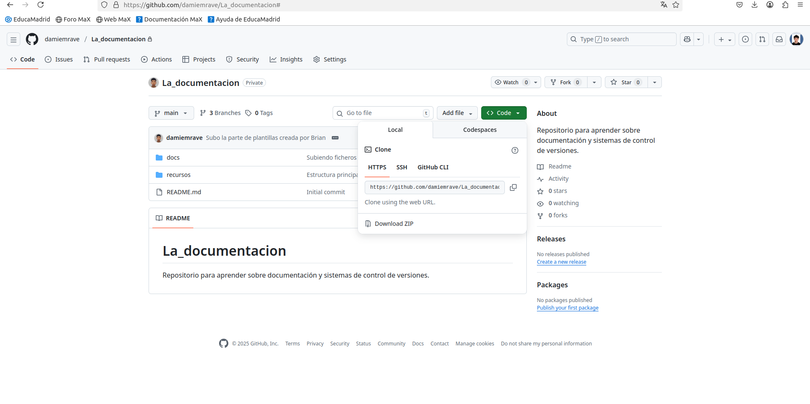

# 6.8. Seguridad de los sistemas de control de versiones

Git se encuentra dentro de los **sistemas de control de versiones distribuidos**.  
En cada equipo de trabajo se tiene una copia del repositorio que se conecta a la red para acceder al repositorio central en **GitHub**.  

El acceso se realiza mediante dos protocolos principales:

- **SSH**
- **HTTPS**

---

## 6.8.1. Protocolo SSH

Permite la **conexión entre dos equipos de forma segura**.  
La implementación consiste en crear en GitHub un repositorio y seleccionar la opción **SSH**.

Al inicializar el repositorio, hacer el primer commit del proyecto y ejecutar el comando `git push`, se copia el proyecto completo en el servidor de control de versiones.

Se puede crear una **clave privada** para encriptar las comunicaciones (en local y en el servidor), o bien establecer una **palabra de paso** que aumente la dificultad de descifrar la información.

---

## 6.8.2. Protocolo HTTPS

Esta opción permite realizar el mismo procedimiento que el anterior, pero utilizando el protocolo **HTTPS** en lugar de SSH.  
Es similar al protocolo HTTP de las páginas web, pero con la inclusión del protocolo **SSL**, que permite **encriptar las comunicaciones** entre el cliente y el servidor.

Git permite configurar ambos protocolos mediante un usuario y contraseña (o token), lo que garantiza que solo los programadores autorizados puedan conectarse.

---

### 🔍 Tabla comparativa SSH vs HTTPS

| **Aspecto** | **🔑 SSH** | **🌐 HTTPS** | **✅ Común** |
|--------------|------------|--------------|--------------|
| **Autenticación** | Claves SSH públicas/privadas | Usuario + contraseña / token | Ambos requieren autenticación para push/pull |
| **Seguridad al acceder a repos** | Muy alta (cifrado asimétrico) | Alta (SSL/TLS) | Comunicación cifrada |
| **Configuración** | Requiere agregar clave | Muy simple |  |
| **Uso en Git** | `git@github.com:user/repo.git` | `https://github.com/user/repo.git` | Clonar, push, pull, fetch |
| **Facilidad** | Algo más complejo | Fácil de usar | Ambos funcionan en GitHub |
| **Recomendado para** | Usuarios frecuentes | Usuarios ocasionales | Permite colaboración remota |

---

# 6.9. Historia de un repositorio

Git permite **conocer todos los cambios realizados, ramas creadas** y otras operaciones sobre el proyecto.  
Para visualizarlo:

1. Selecciona el nombre del proyecto con el botón derecho del ratón.  
2. Accede a: **Git → Show History**.

---

## Opciones de filtrado en el historial

- **Message**: filtra por los mensajes escritos al realizar un commit en una rama concreta.  
- **Author**: muestra los commits realizados por un programador específico del equipo.  
- **Branch**: busca los cambios dentro de una rama determinada.  
- **From / To**: filtra las operaciones realizadas entre fechas concretas.

---

## Operación DIFF para comparar versiones

En **GitHub** (y en Git en general), la opción **Show History → Diff** permite **ver las diferencias entre versiones** de un archivo.

El *diff* muestra qué líneas han sido **agregadas**, **modificadas** o **eliminadas** entre dos commits:

- Líneas **añadidas** → en **verde** con un signo `+`  
- Líneas **eliminadas** → en **rojo** con un signo `-`  
- Líneas **sin cambios** → aparecen como contexto (en blanco o gris)

---

### 🧩 Utilidad del diff

- Permite **revisar los cambios realizados** en un archivo.  
- Facilita **auditar el código** y detectar errores o modificaciones no deseadas.  
- Es útil para la **colaboración en equipo**, ya que antes de hacer un *merge* o *pull request* se pueden verificar los cambios.  
- Proporciona un **historial detallado** que permite rastrear **cuándo y por qué** se realizaron modificaciones en el código.

---

