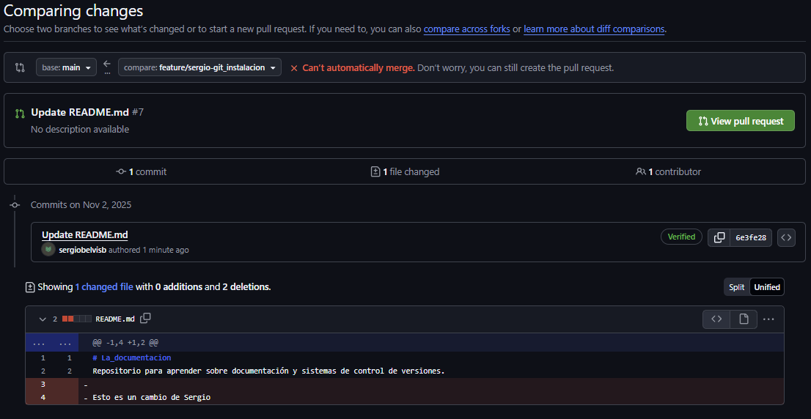
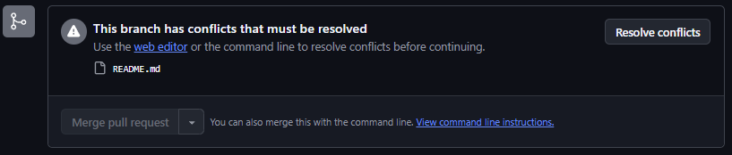
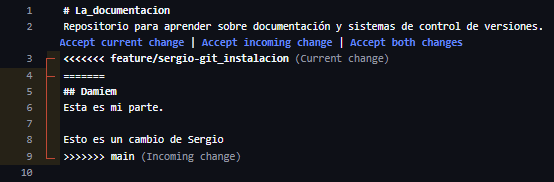
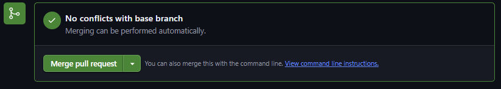
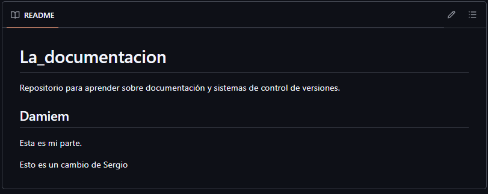

# Conflictos entre archivos en común

---

# 📋 Índice

1. [Conflictos entre archivos en común](#conflictos)

---

# Conflictos entre archivos en común {#conflictos}

Al modificar un archivo que puede modificar otra persona, puede haber conflictos de modificación sincronizada. 
Esto ocurre cuando dos personas modifican un mismo archivo a la vez y quieren hacer pull request. 
Las dos personas tienen una versión vieja del archivo (sin las actualizaciones que hizo la otra persona). 
Por tanto, GitHub controla esto y te avisa con las siguientes alertas:

---

## 1. Error al hacer el Pull Request

A la hora de hacer el pull request, te aparece el error de que el archivo tiene otra configuración que tú no tienes desde un principio. 
Te muestra las líneas que tienen discordancia entre sí en rojo.

---

## 2. Visualización del Pull Request

Si le damos al botón verde de “View Pull Request” podemos observar el problema y nos da una opción para poder resolver el conflicto dicho.

---

## 3. Resolución de Conflictos

Al darle a “Resolve Conflicts” nos manda a un editor web donde nos indican qué parte tenemos distinta al archivo actual. 
Podemos hacer 3 opciones:

1. Subir el archivo con los cambios que hiciste tú (**Accept current change**).
2. Subir el archivo con los cambios que hizo la otra persona colaboradora (**Accept incoming change**).
3. Subir el archivo combinando los cambios que habéis hecho los dos colaboradores (**Accept both changes**).

---

## 4. Fusión del Pull Request

Después de esto, el aviso de conflicto que nos daba ya ha cambiado por el botón de hacer merge pull request para subirlo a la rama que queramos.

---

## 5. Resultado final

Aquí tenemos el resultado de darle a la opción de “Accept both changes”.

---
